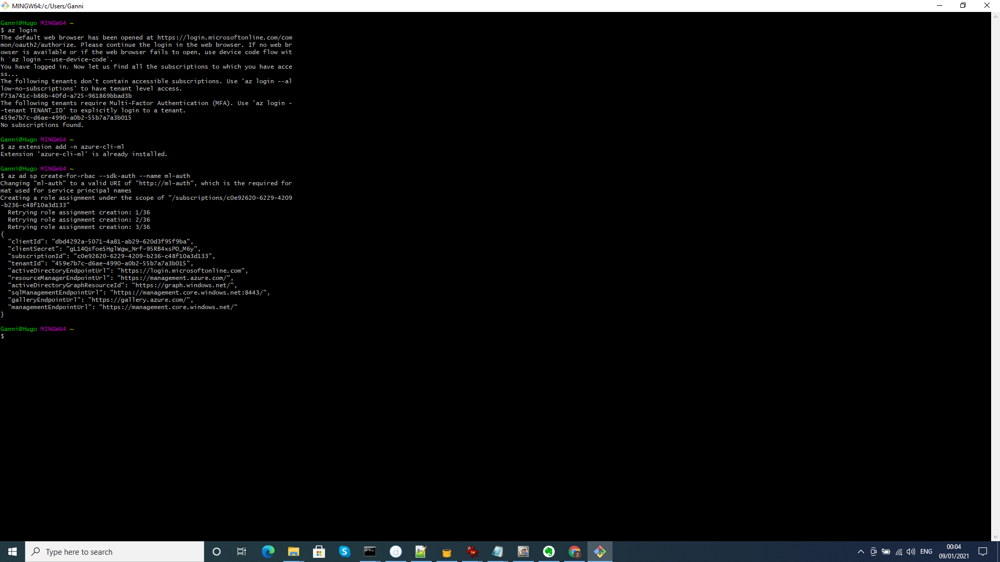
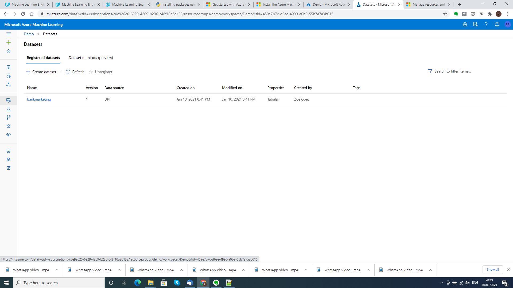
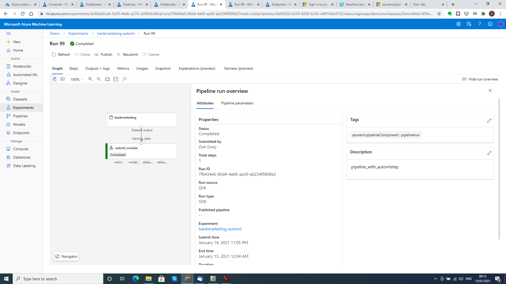
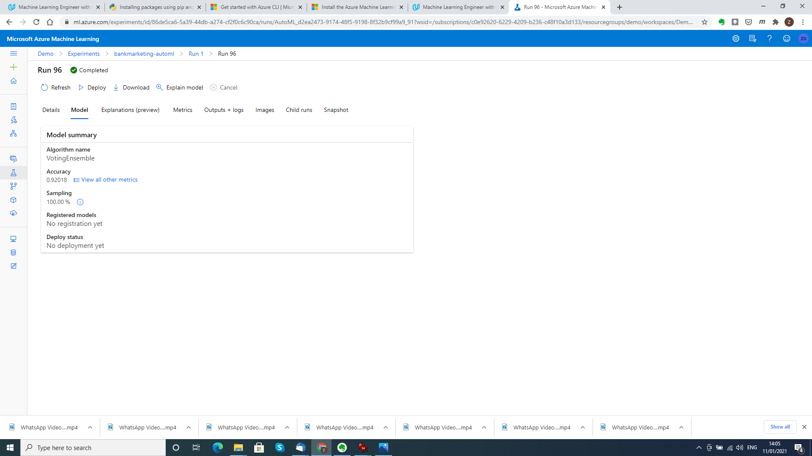
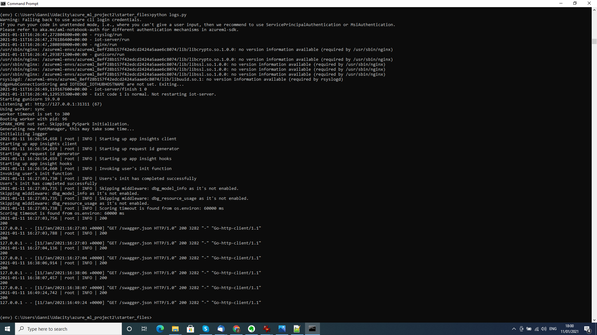
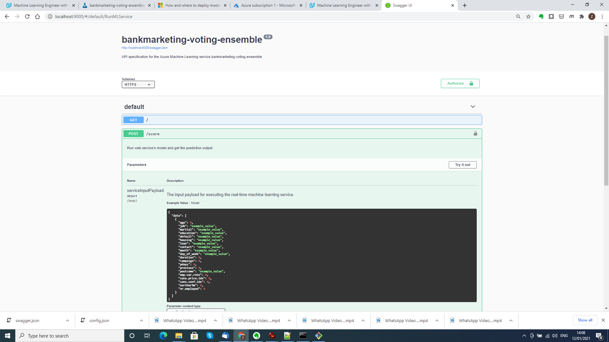

# Operationalizing machine learning

This repository includes an implementation the second project of the Udacity course *Machine Learning with Microsoft Azure*. It demonstrates various aspects of operationalizing a machine learning model, including automated Azure authentication, deployment and logging of an AutoML model, documentation and consumption of a model endpoint and the creation and deployment of machine learning pipelines.

## Architectural Diagram
*TODO*: Provide an architectual diagram of the project and give an introduction of each step. An architectural diagram is an image that helps visualize the flow of operations from start to finish. In this case, it has to be related to the completed project, with its various stages that are critical to the overall flow. For example, one stage for managing models could be "using Automated ML to determine the best model". 

## Key Steps
*TODO*: Write a short discription of the key steps. Remeber to include all the screenshots required to demonstrate key steps. 
1. Authentication
   
   Since the project is implemented on a personal Azure account, we can include an  automated authentication step by creating of a service principal. This is an isolated step      that is not used in the remainder of the project.
     
   
   *Creation of the service principal*
   
2. Automated ML Experiment

   The first official step of the project is the creation of an AutoML experiment using a bankmarketing dataset. We wish to predict the success of direct marketing in a banking    context. First we load the dataset into into Azure, then we run an AutoML experiment on the dataset, and finally we have a look at the best model it finds.
     
   
   *Bankmarketing dataset*
   
     
   
   *Completed AutoML experiment*
   
     
   
   *Best model*
   
3. Deploy the best model

   We now deploy the best model AutoML has found using a Azure Container Instance. We enable authentication.
4. Enable logging

   We also enable Application Insights to generate logs. We then view these logs by running the Python script [logs.py](../logs.py).
     
   
   *Logs*
   
5. Swagger Documentation

   We now consume the model endpoint with Swagger to generate documentation on its usage.
     
   
   *Swagger running on localhost*
   
6. Consume model endpoints
7. Create and publish a pipeline

## Screen Recording
*TODO* Provide a link to a screen recording of the project in action. Remember that the screencast should demonstrate:

## Standout Suggestions
*TODO (Optional):* This is where you can provide information about any standout suggestions that you have attempted.
