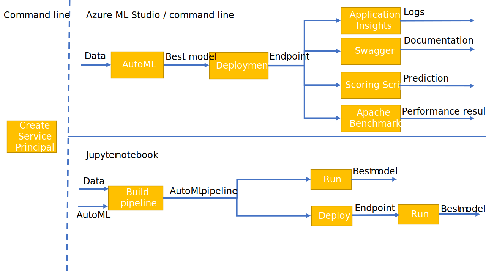
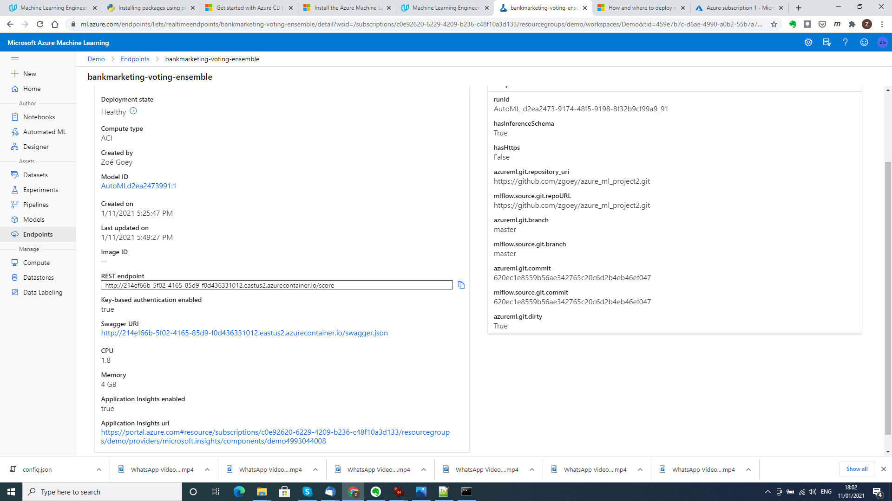
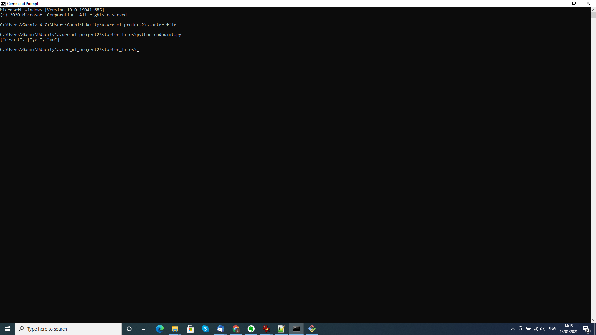
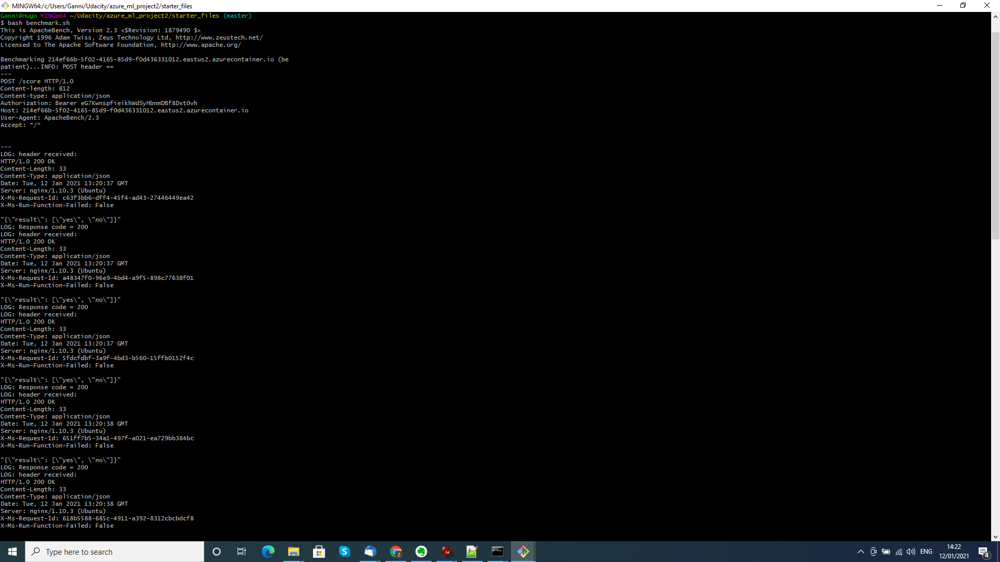
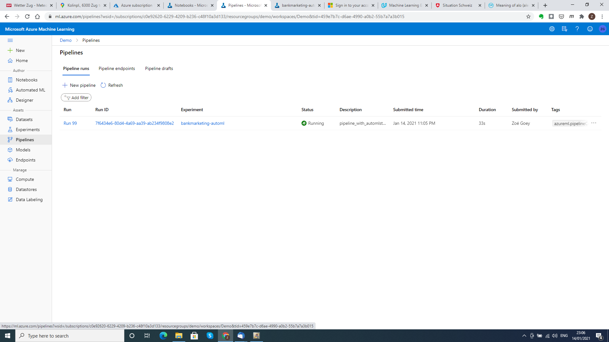
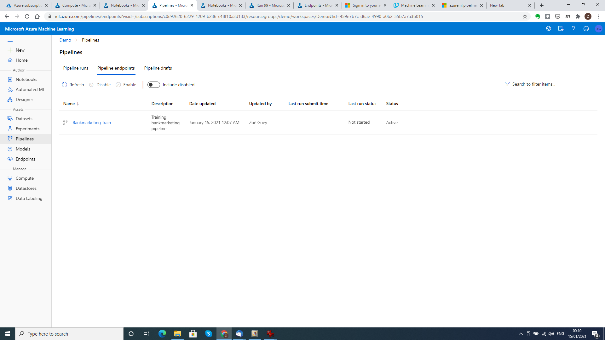
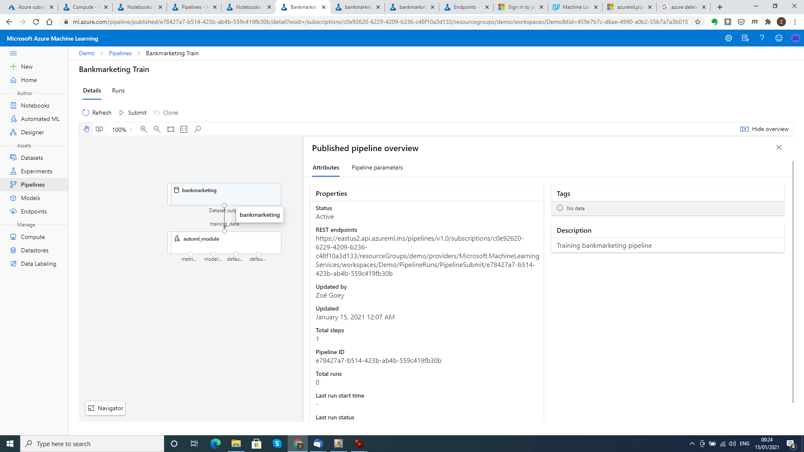
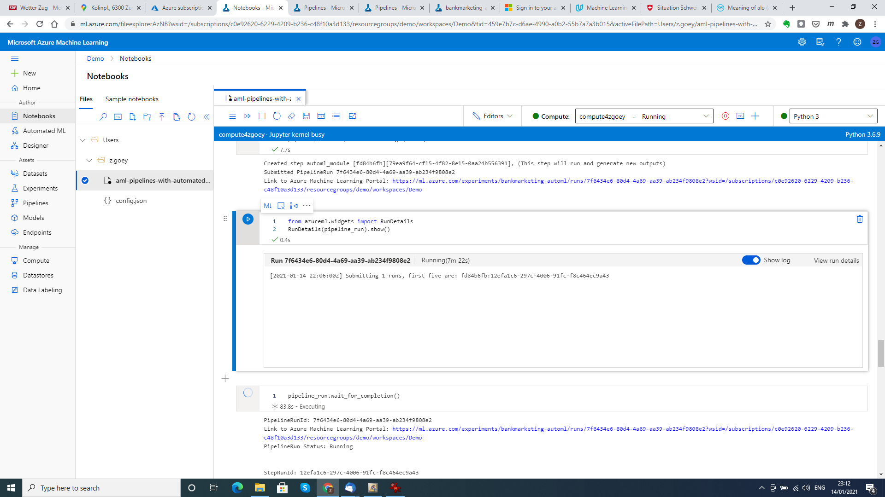
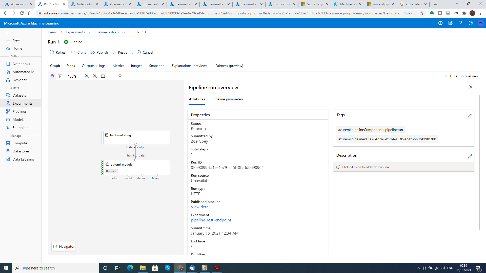

# Operationalizing machine learning

This repository contains an implementation of the second project of the Udacity course *Machine Learning with Microsoft Azure*. It demonstrates various aspects of operationalizing a machine learning model, including automated Azure authentication, deployment and logging of an AutoML model, documentation and consumption of a model endpoint and the creation and deployment of machine learning pipelines.

## Architectural Diagram
The project can roughly be divided in three stages:
1. Automated authentication (carried out as an optional isolated step)
2. Best model generation using AutoML  + consecutive deployment, documentation generation, benchmarking and consumption
3. Pipeline construction, run execution and deployment. 

The diagram below depicts these three stages and their consecutive steps.
  

## Key Steps
1. Authentication
   
   Since the project is implemented on a personal Azure account, we can include an automated authentication step by creating of a service principal. This is an isolated step        that is not used in the remainder of the project.
   
   *Creation of the service principal*
   
2. Automated ML Experiment

   The first official step of the project is the creation of an AutoML experiment using a bankmarketing dataset. We wish to predict the success of direct marketing in a banking    context. First we load the dataset into into Azure, then we run an AutoML experiment on the dataset, and finally we have a look at the best model it finds.
   
   *Bankmarketing dataset*
   
     
   
   *Completed AutoML experiment*
   
     
   
   *Best model*
   
3. Deploy the best model

   We now deploy the best model AutoML has found using a Azure Container Instance. We enable authentication.
4. Enable logging

   We also enable Application Insights to generate logs. We then view these logs by running the Python script [logs.py](./logs.py).
   
   *Application Insights enabled*
   
   
   *Logs*
   
5. Swagger Documentation

   We now consume the model endpoint with Swagger to generate documentation on its usage.
   
   *Swagger running on localhost*
   
6. Consume model endpoints

   Now that we know how to interact with the model endpoint, we can use it to make predictions. This is done in in the script [endpoint.py](./endpoint.py). We also test the        performance of the model enpoint using Apache Benchmark (see also [benchmark.sh](./benchmark.sh)). 
   
   *Running endpoint.py*
   
     
   
   *Apache Benchmark*
   
7. Create and publish a pipeline

   In the final step of our project we create a pipeline with a single AutoML step that takes the bankmarketing dataset as its input. We then publish this pipeline and run it      from its REST endpoint.
   
   *Pipeline*
   
     
   
   *Pipeline endpoint*
   
     
   
   *Bankmarketing dataset with AutoML module (graphical representation of pipeline run)*
   
     
   
   *Published pipeline overview*
   
     
   
   *RunDetails widget in Jupyter notebook*
   
     
   
   *Published pipeline run*
   
     

## Screen Recording
A screencast describing this project can be found under: https://youtu.be/Dcg2eFTvSH0.

## Standout Suggestions
All the suggested optional work that we carried out has been mentioned in the Key Steps section (see list items 1. Authentication and 6. Consume Endpoints). 

## Possible Improvements
To enhance the project even further the following ideas could be considered:
- using the service principal for authentication in the project (instead of interactive authentication),
- generating a better model by running AutoML for a longer time,
- implementing interaction with the model through a proper UI.
